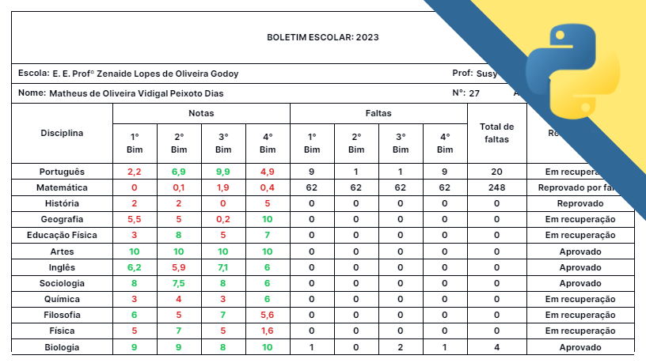
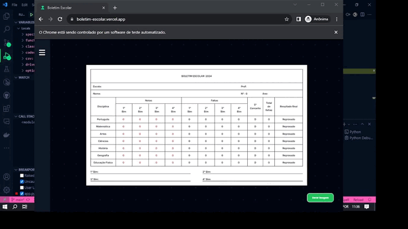

<h1 align="center">
    
</h1>
<p align="center">
    
    
    
    <a href="https://github.com/NyctibiusVII/AutoSchoolCard/blob/main/LICENSE">
        
    </a>
</p>
<p align="center">
    <a href="#autoschoolcard-">Projeto</a>&nbsp;&nbsp;&nbsp;|&nbsp;&nbsp;&nbsp;
    <a href="#tecnologias-">Tecnologias</a>&nbsp;&nbsp;&nbsp;|&nbsp;&nbsp;&nbsp;
    <a href="#layout-">Layout</a>&nbsp;&nbsp;&nbsp;|&nbsp;&nbsp;&nbsp;
    <a href="#licença-%EF%B8%8F">Licença</a>
</p>

# AutoSchoolCard 
Automatizar a geração de Boletins escolares para escolas / professores 🤖📄

#### Funcionalidades
* Criação de boletim escolar através de um arquivo CSV
* Gera boletim escolar de um aluno a cada 5 segundos
* Automação para o projeto [BoletimEscolar](https://github.com/NyctibiusVII/BoletimEscolar)

## Tecnologias 🚀
Esse projeto foi desenvolvido com as seguintes tecnologias:
- [Python](https://www.python.org)
- [Selenium](https://www.selenium.dev)
- [Codecs](https://docs.python.org/pt-br/3/library/codecs.html)
- [CSV](https://docs.python.org/pt-br/3/library/csv.html)

## Layout 🚧
### Desktop Gif
<div style="display: flex; flex-direction: 'column'; align-items: 'center';">
<!-- 1050 x 718 -->
    
</div>

## Rodando o projeto 🚴🏻‍♂️
```bash
# Clone o repositório
$ git clone https://github.com/NyctibiusVII/AutoSchoolCard.git

# Acesse a pasta do projeto no terminal
$ cd AutoSchoolCard

# Instale as dependências com o gerenciador de pacotes de sua preferência
$ pip install selenium [...]

# Execute o projeto
$ python app.py
```

## Contribuição 💭
Confira a página de [contribuição](./CONTRIBUTING) para ver como começar uma discussão e começar a contribuir.

## Licença ⚖️
Este projeto está sob a licença do MIT. Veja o arquivo [LICENSE](https://github.com/NyctibiusVII/AutoSchoolCard/blob/main/LICENSE) para mais detalhes.

## Contribuidores 🦸🏻‍♂️
<a href="https://github.com/NyctibiusVII/AutoSchoolCard/graphs/contributors">
    
</a>

<br/>
<br/>

###### Feito com ❤️ por Matheus Vidigal 👋🏻 [Entre em contato!](https://www.linkedin.com/in/matheus-vidigal-nyctibiusvii)